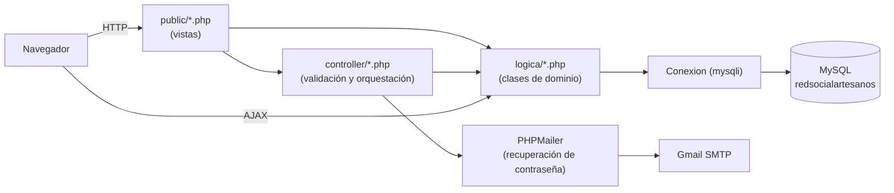
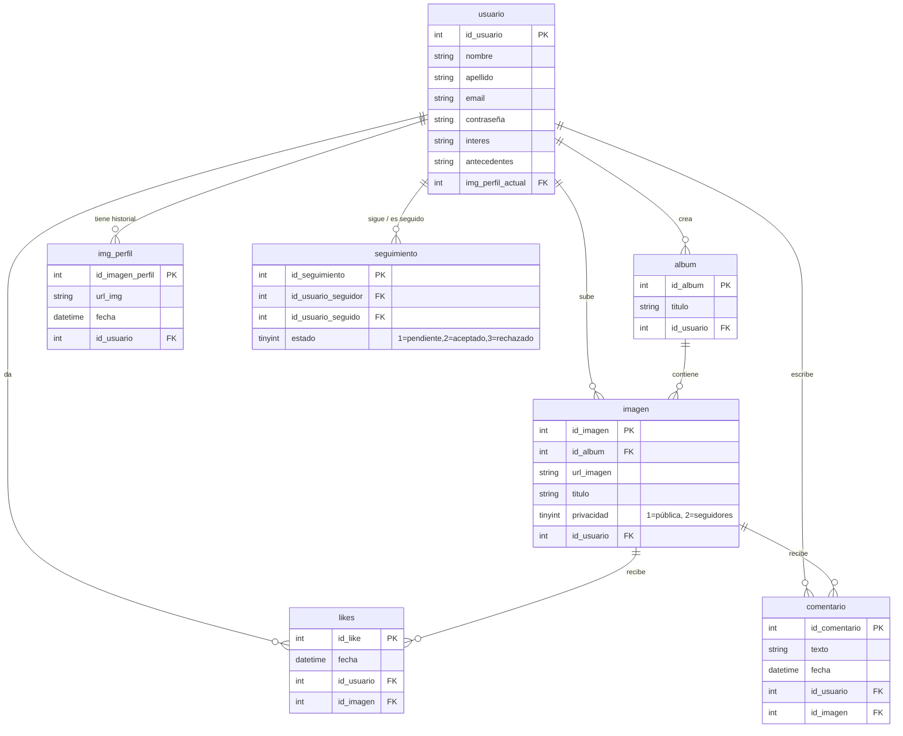

# 🧵 Red Social Artesanos

> Red social pensada para que artesanos publiquen su trabajo, se sigan entre sí y construyan comunidad alrededor de su oficio — a la manera de Instagram, pero hecha desde cero en PHP puro.


---

## 📖 Sobre el proyecto

**Red Social Artesanos** es un proyecto personal full-stack en PHP orientado a explorar cómo se construye, desde los cimientos y sin frameworks, una red social con las piezas que la hacen "social": cuentas de usuario, seguimiento entre perfiles con aprobación manual, publicación de álbumes de fotos con control de privacidad, likes, comentarios y un feed ordenado por popularidad.

La idea de negocio es simple: darle a artesanos un espacio propio para mostrar y compartir su trabajo, similar en espíritu a Instagram pero con un modelo de seguimiento tipo "cuenta privada" (toda solicitud de seguimiento debe ser aceptada por el usuario seguido).

Este repositorio se mantiene como pieza de portfolio: el objetivo no es la perfección productiva sino demostrar manejo de PHP orientado a objetos, SQL, sesiones, subida de archivos, envío de emails y JavaScript vanilla para interacciones AJAX, todo sin frameworks de por medio.

## ✨ Funcionalidades

- **Registro e inicio de sesión** con validación en cliente y servidor (regex de nombre/email/contraseña), contraseñas hasheadas con `password_hash` y protección básica contra inyección SQL mediante `mysqli_real_escape_string`.
- **Recuperación de contraseña por email**: flujo de 3 pasos (solicitar → verificar código de 6 dígitos con expiración de 15 minutos → definir nueva contraseña), usando PHPMailer sobre SMTP de Gmail.
- **Perfil de usuario**: nombre, apellido, intereses, antecedentes y foto de perfil, con historial de fotos de perfil subidas.
- **Álbumes y galería**: creación de álbumes con múltiples imágenes por subida, título por álbum/numerado/individual, y **privacidad por imagen** (pública o solo para seguidores aceptados).
- **Sistema de seguimiento con aprobación**: enviar solicitud de seguimiento, aceptarla o rechazarla desde una bandeja de solicitudes — el contenido privado solo se desbloquea cuando la solicitud fue aceptada.
- **Feed / Explorar**: galería tipo masonry con las publicaciones visibles para el usuario, ordenadas por cantidad de likes (top 8 en el inicio, feed completo en "Explorar").
- **Likes y comentarios en tiempo real** vía AJAX (sin recargar la página), con modal de imagen ampliada.
- **Notificaciones de solicitudes** de seguimiento pendientes.

## 🏗️ Arquitectura

El proyecto sigue una separación simple en capas, sin framework, organizada por convención de carpetas:

```
public/      → Vistas/páginas accesibles desde el navegador (punto de entrada)
controller/  → Orquesta la petición: recibe $_POST/$_GET, valida y arma los datos para la vista
logica/      → Clases de dominio y acceso a datos (Conexion, Usuario, ContenidoImagen, DatosUser, Like, Comentario)
assets/      → CSS y JavaScript (validación de formularios, navegación, likes/comentarios AJAX, masonry)
libs/        → Dependencias de Composer (PHPMailer)
```



### Modelo de datos



> ⚠️ El proyecto no incluye un archivo `.sql` de instalación: el esquema fue reconstruido a partir de las consultas presentes en el código (`logica/*.php`). Si vas a levantar el proyecto, deberás crear estas tablas manualmente en una base llamada `redsocialartesanos`.

## 🛠️ Stack técnico

| Capa | Tecnología |
|---|---|
| Backend | PHP 8 (orientado a objetos + procedural), `mysqli` |
| Base de datos | MySQL |
| Frontend | HTML5, CSS3, JavaScript vanilla (Fetch/AJAX) |
| Envío de correo | [PHPMailer](https://github.com/PHPMailer/PHPMailer) vía SMTP (Gmail) |
| Gestión de dependencias | Composer |
| UI extra | Bootstrap 5, Boxicons, Material Icons (en formularios de auth y gestión de perfil) |

## 🚀 Instalación local

**Requisitos:** PHP 8+, servidor web (Apache/XAMPP/Laragon/`php -S`), MySQL, Composer.

1. Cloná el repositorio dentro de la carpeta pública de tu servidor (por ejemplo `htdocs/` en XAMPP):
   ```bash
   git clone https://github.com/RibZu/redSocialArtesanos.git
   ```
2. Instalá las dependencias de PHP:
   ```bash
   cd redSocialArtesanos/libs
   composer install
   ```
3. Creá la base de datos `redsocialartesanos` en MySQL y las tablas descritas en el [modelo de datos](#modelo-de-datos) (`usuario`, `img_perfil`, `album`, `imagen`, `seguimiento`, `likes`, `comentario`).
4. Configurá la conexión a la base de datos en [`logica/conexion.php`](logica/conexion.php) (usuario, contraseña y nombre de la base si difieren de los valores por defecto).
5. Para que funcione la recuperación de contraseña por email, completá las credenciales SMTP en [`controller/enviarGmail.php`](controller/enviarGmail.php) (`$mail->Username` / `$mail->Password`, usando una [contraseña de aplicación de Google](https://myaccount.google.com/apppasswords)).
6. Iniciá sesión con tu servidor y accedé a `public/login.php` (por ejemplo `http://localhost/redSocialArtesanos/public/login.php`).

## 📂 Estructura del repositorio

```
├── assets/       # CSS y JS (validaciones, navegación, likes/comentarios AJAX, masonry)
├── controller/   # Handlers de formularios y orquestación (registro, login, seguimiento, email)
├── logica/       # Clases de dominio y acceso a datos + conexión a MySQL
├── public/       # Páginas de la app (login, feed, explorar, perfil, álbumes, solicitudes)
└── libs/         # Dependencias de Composer (PHPMailer)
```

## ⚠️ Notas y alcance

Este es un proyecto de aprendizaje/portfolio, no una app en producción. Algunas decisiones quedaron deliberadamente simples y son áreas conocidas de mejora:

- Las credenciales de base de datos y SMTP están hardcodeadas en el código en vez de usar variables de entorno.
- Las consultas SQL se arman por concatenación de strings (no *prepared statements*), mitigado parcialmente con `mysqli_real_escape_string` en los formularios de autenticación.
- No hay una migración/seed automatizada de la base de datos.

## 👤 Autor

Proyecto desarrollado por [RibZu](https://github.com/RibZu).
